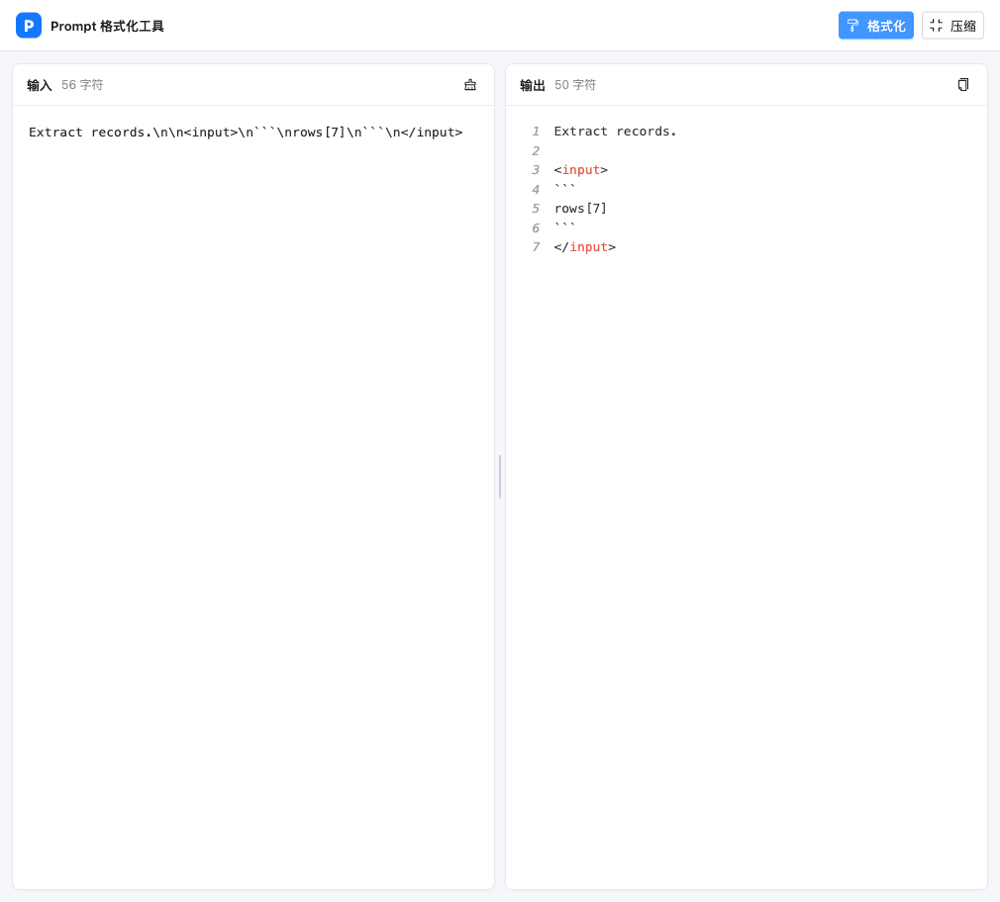

# Prompt 格式化工具（Prompt Formatting Tool）

> 一款 Chrome 扩展 + Web 双形态的 Prompt 内容格式化 / 压缩工具：在「带转义的单行行文本」与「可读的多行 Markdown」之间一键双向转换。



## ✨ 解决什么问题

从 API 请求日志、对话数据集或代码中复制出来的 prompt 通常是这样的单行转义文本：

```
"content": "Extract spare-part records.\n\n<input>\n```\nrows[7]{r,cells}:\n...\n```\n</input>",
```

难以阅读、难以编辑。本工具将其一键还原为格式化的 Markdown：

- **格式化**：行文本 → 多行 Markdown（反转义 `\n` `\"` `\\` 等）
- **压缩**：多行 Markdown → 单行行文本（JSON 安全转义，可直接嵌回 JSON）

## 🚀 功能特性

| 功能 | 说明 |
| --- | --- |
| 格式化 | 反转义 `\n \r \t \b \f \" \\ \/ \uXXXX`，还原为可读 Markdown |
| 压缩 | 格式化的逆操作，输出可直接嵌入 JSON 字符串的单行文本 |
| 自动过滤 | 粘贴时自动剥离 `"content": "` 前缀、`",` 后缀等 JSON 包装碎片 |
| Markdown 高亮 | 右侧输出区语法高亮 + 行号显示 |
| 三栏布局 | 左输入 / 右输出 / 中间可拖拽调节宽度，高度自适应（页面高度 − 顶栏） |
| 一键复制 | 输出结果一键复制到剪贴板 |
| Ant Design | 全部组件 small 尺寸、light 主题、Ant Icons |

## 📦 安装与使用

### 方式一：Chrome 扩展

1. 克隆并构建：

   ```bash
   git clone https://github.com/<your-username>/prompt-formatting-tool.git
   cd prompt-formatting-tool
   npm install
   npm run build
   ```

2. 打开 Chrome，访问 `chrome://extensions`，开启右上角「开发者模式」
3. 点击「加载已解压的扩展程序」，选择项目中的 **`dist`** 目录
4. 点击浏览器工具栏中的插件图标，工具会在新标签页打开

> 修改源码后需重新 `npm run build`，并在扩展页面点击该扩展的刷新按钮（↻）。

### 方式二：Web 应用（本地开发）

```bash
npm install
npm run dev
```

浏览器访问 <http://localhost:5173>，支持热更新，适合开发调试。

## 🔧 转义规则

**压缩（Markdown → 行文本）完整转义清单：**

| 原字符 | 转义结果 | 原字符 | 转义结果 |
| --- | --- | --- | --- |
| `\` | `\\` | 换行 | `\n` |
| `"` | `\"` | 回车 | `\r` |
| Tab | `\t` | 退格 | `\b` |
| 换页 | `\f` | 其他控制字符 (U+0000–U+001F) | `\uXXXX` |

> 注：`/` 在 JSON 中无需转义（`\/` 合法但非必需），故不做处理；Unicode 字符保持原样，保证可读性。

**格式化（行文本 → Markdown）** 优先使用 `JSON.parse` 覆盖全部标准转义；
对包含裸换行、裸引号等非严格 JSON 输入，自动退回逐字符反转义，保证健壮性。

## 🗂 项目结构

```
├── public/                    # 静态资源（构建时原样拷贝至 dist）
│   ├── manifest.json          # Chrome 扩展清单（MV3）
│   ├── background.js          # Service Worker：点击图标打开工具页
│   ├── icons/                 # 扩展图标 16/32/48/128
│   └── _locales/              # 国际化文案（zh_CN / en）
├── src/
│   ├── App.jsx                # 三栏布局 + 操作区 + 拖拽分栏
│   ├── App.css                # 布局样式
│   ├── lib/prompt.js          # 核心逻辑：sanitize / format / compress
│   └── main.jsx               # 入口（Ant Design ConfigProvider）
├── index.html
└── vite.config.js             # base: './' 适配 chrome-extension:// 加载
```

## 🧰 技术栈

- [React 18](https://react.dev/) + [Vite 5](https://vitejs.dev/)
- [Ant Design 5](https://ant.design/)（small 尺寸 / light 主题）
- [@ant-design/icons](https://ant.design/components/icon)
- [react-syntax-highlighter](https://github.com/react-syntax-highlighter/react-syntax-highlighter)（Prism · Markdown 高亮 · 行号）
- Chrome Extension [Manifest V3](https://developer.chrome.com/docs/extensions/mv3/)，零权限申请

## 🛠 可用脚本

| 命令 | 说明 |
| --- | --- |
| `npm run dev` | 启动本地开发服务器（Web 形态） |
| `npm run build` | 构建生产产物至 `dist/`（可直接加载为 Chrome 扩展） |
| `npm run preview` | 本地预览构建产物 |

## 📄 License

[Apache License 2.0](LICENSE) © Prompt Formatting Tool Contributors
