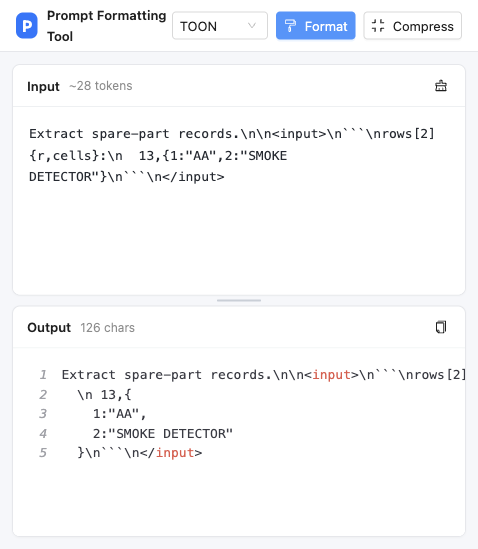

# Prompt Formatting Tool

> A Prompt formatting / compression tool available as both a Chrome extension and a web app: one-click, bidirectional conversion between "escaped single-line text" and "readable multi-line Markdown".



## ✨ Problem It Solves

Prompts copied from API request logs, conversation datasets, or code usually look like this escaped single-line text:

```
"content": "Extract spare-part records.\n\n<input>\n```\nrows[7]{r,cells}:\n...\n```\n</input>",
```

Hard to read, hard to edit. This tool restores it to formatted Markdown with one click:

- **Format**: single-line text → multi-line Markdown (unescapes `\n` `\"` `\\`, etc.)
- **Compress**: multi-line Markdown → single-line text (JSON-safe escaping, ready to embed back into JSON)

## 🚀 Features

| Feature | Description |
| --- | --- |
| Format | Unescapes `\n \r \t \b \f \" \\ \/ \uXXXX`, collapses runs of spaces/tabs, restores readable Markdown |
| Compress | The inverse of formatting; outputs single-line text that can be embedded directly in a JSON string |
| Compression denoising | Same-shape denoising as formatting (strips `"content": "` wrapper and outer quotes); collapses runs of ≥2 spaces/tabs into a single space; normalizes `<br>`/`<br/>`/`<br />` to `\n`; removes fullwidth quotes `＂` `＇` |
| Auto filtering | Automatically strips JSON wrapper debris such as the `"content": "` prefix and `",` suffix on paste |
| Markdown highlighting | Syntax highlighting + line numbers in the output panel |
| Three-column layout | Input on the left / output on the right / draggable divider to adjust width; height adapts to the page (page height − top bar) |
| One-click copy | Copy the output to the clipboard with one click |
| Ant Design | All components in small size, light theme, with Ant Icons |

## 📦 Installation & Usage

### Option 1: Chrome Extension

1. Clone and build:

   ```bash
   git clone https://github.com/wentongCloud/prompt-formatting-tool.git
   cd prompt-formatting-tool
   npm install
   npm run build
   ```

2. Open Chrome, go to `chrome://extensions`, and enable "Developer mode" in the top-right corner
3. Click "Load unpacked" and select the **project directory** or its **`dist`** directory. Both are loadable after building; do not select `public` or a ZIP file.
4. Click the extension icon in the browser toolbar; the tool opens in a new tab

> After modifying the source code, run `npm run build` again and click the refresh button (↻) of the extension on the extensions page.

> If Chrome reports "Manifest file is missing or unreadable", run `npm run build` and select the folder containing the generated `manifest.json`. The root entry and `dist` share the same application bundle; `public/manifest.json` is the only manifest source.

### Option 2: Web App (local development)

```bash
npm install
npm run dev
```

Visit <http://localhost:5173> in your browser. Hot reload is supported, ideal for development.

## 🔧 Escaping Rules

**Compress (Markdown → single-line text) — full escape table:**

| Source char | Escaped as | Source char | Escaped as |
| --- | --- | --- | --- |
| `\` | `\\` | newline | `\n` |
| `"` | `\"` | carriage return | `\r` |
| Tab | `\t` | backspace | `\b` |
| form feed | `\f` | other control chars (U+0000–U+001F) | `\uXXXX` |

> Note: `/` does not need escaping in JSON (`\/` is legal but not required), so it is left alone; Unicode characters are kept as-is for readability.
> Compression also normalizes whitespace (see "Compression denoising"); CR/CRLF is normalized to LF first.
> Multi-line Markdown is fully escaped; if compressed fragments (literal `\n` / `\"`) are mixed in, denoising runs first: only that layer of `\n`/`\"` escapes is peeled (literal `\t`/`\\` are untouched, protecting paths/regex) before encoding, so the product carries exactly one escape layer and repeated compression never stacks. Inside an inline code span a literal `\n` is **never** expanded into a real line break — the span is single-line by nature, so it can only be describing the character.
> Gate (single-line text): if the input already contains legal escapes (`\"` `\\` `\n` `\r` `\b` `\f` `\uXXXX`), they are protected as-is and never double-escaped; repeated compression never stacks layers. A bare quote `"` is always escaped to `\"`, guaranteeing the product is a valid JSON string body.
> Literal `\t` is not treated as an existing escape: Windows paths/regex (`C:\tmp`, `\d+`) are far more common than escaped Tabs, so their backslashes are escaped per the table to `\\t`; a single real Tab character outputs `\t`.

**Format (single-line text → Markdown)** prefers `JSON.parse` to cover all standard escapes;
for non-strict JSON input containing bare newlines, bare quotes, etc., it automatically falls back to character-by-character unescaping for robustness.

> Inline code spans (`` `…` `` / ``` ``…`` ```) hold **character descriptions**, not structural escapes. They are peeled in lockstep with the surrounding prose — the same number of layers, strict single-layer decode — and never further, so a description such as ``Escape value line breaks as `\n` `` is kept verbatim instead of being torn apart by a physical line break. Fenced code blocks are structural text and are peeled normally.

> Whitespace collapsing: both formatting and compression collapse runs of ≥2 spaces/tabs into a single space; formatting preserves leading indentation and trailing whitespace per line (Markdown indented code blocks / hard line break semantics), and fenced code blocks are kept as-is. During compression, an escaped `\n` is treated as a line boundary, so indentation after it is stripped rather than collapsed to a single space; `\\n` (escaped backslash + literal n) is not a line break.
> `<br>` normalization, fullwidth quote removal, and line-end trimming happen only on the compression side. Exception: HTML collapses whitespace between tags per whitespace semantics, but the contents of `<pre>`/`<textarea>`/`<script>`/`<style>` are preserved as-is.

## 🗂 Project Structure

```
├── public/                    # Static assets (copied as-is to dist on build)
│   ├── manifest.json          # Chrome extension manifest (MV3)
│   ├── background.js          # Service worker: opens the tool page on icon click
│   ├── icons/                 # Extension icons 16/32/48/128
│   └── _locales/              # i18n messages (zh_CN / en)
├── src/
│   ├── main.jsx               # Entry + three-column layout UI (Ant Design ConfigProvider)
│   ├── transform.js           # Orchestrator: type detection / cleanPromptInput / formatPrompt / compressPrompt
│   ├── escape.js              # Escape codec: paired-scan state machine, gate passthrough encoding, whitespace preservation
│   ├── json.js                # JSON: multi-layer peeling parse, jsonrepair fallback, formatting
│   ├── html.js                # HTML: prettier-style tree building and single-line collapse, whitespace-sensitive elements preserved
│   ├── toon.js                # TOON: quote-aware peeling, multi-document splitting, value-level formatting
│   ├── transform.test.js      # Unit tests (node --test)
│   └── styles.css             # Layout styles
├── index.html
└── vite.config.js             # base: './' to support loading via chrome-extension://
```

## 🧰 Tech Stack

- [React 18](https://react.dev/) + [Vite 5](https://vitejs.dev/)
- [Ant Design 5](https://ant.design/) (small size / light theme)
- [@ant-design/icons](https://ant.design/components/icon)
- [react-syntax-highlighter](https://github.com/react-syntax-highlighter/react-syntax-highlighter) (Prism · Markdown highlighting · line numbers)
- Chrome Extension [Manifest V3](https://developer.chrome.com/docs/extensions/mv3/), requesting only `clipboardWrite` (for one-click copying of output)

## 🛠 Available Scripts

| Command | Description |
| --- | --- |
| `npm run dev` | Start the local dev server (web mode) |
| `npm test` | Run unit tests for the core logic |
| `npm run test:extension` | Build and verify both extension loading directories and toolbar page paths |
| `npm run build` | Build production artifacts to `dist/` (loadable directly as a Chrome extension) |
| `npm run preview` | Preview the build artifacts locally |

## 📄 License

[Apache License 2.0](LICENSE) © Prompt Formatting Tool Contributors
